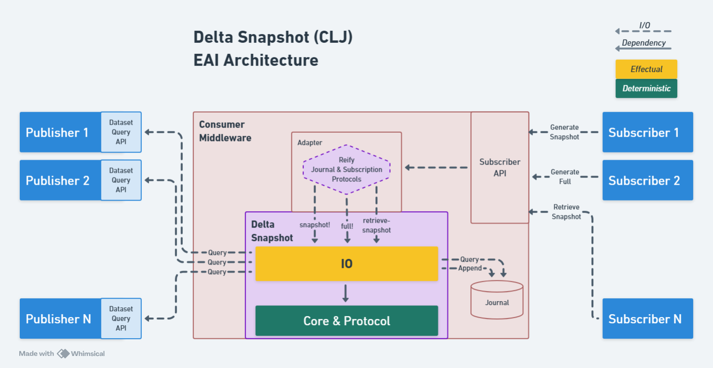

# Delta Snapshot (alpha)

Delta Snapshot is a Clojure integration library that enables a system of reference (a *subscriber*) to mirror a system of record (a *publisher*) data set by making periodic, on-demand requests for deltas generated against the publisher data set. The library consumer hosts an append-only *journal* database (sql or no-sql) that persists each data set and its delta history; the consumer implements a protocol enabling the library to interface with the journal. Delta Snapshot adopts an inversion of the pub-sub pattern where the publisher is passive, the subscriber is active, and communication is synchronous.

## Publishers and Subscribers

A publisher is a system of record that makes full data sets available via a query API. A subscriber is a system of reference that mirrors a publisher data set by making on-demand requests for deltas that have occurred in the publisher data set since the subscriber's previous request. Delta Snapshot handles subscriber requests, pulls from the publisher, and generates deltas to return to the subscriber.

## Subscription

A subscription represents a subscriber being registered for a specific publisher data set. A subscription also represents a data set that is particular to its subscriber. Even if two subscribers subscribe to an identical publisher data set, there are two distinct data sets, each with a unique data set id and delta history specific to the subscriber. Every subscription is represented by an instance of the [`SubscriptionConfig`](src/delta_snapshot_clj/subscription.clj) protocol.

An *entity* refers to a row retrieved for a subscriber from a publisher data set. Each entity should have an id accessible by a keyword defined in the [`SubscriptionConfig`](src/delta_snapshot_clj/subscription.clj) protocol. A publisher data set must be a reducible (`clojure.lang.IReduceInit`) of entity hashmaps. Using records instead of hashmaps is recommended to improve performance.

## Snapshot

A snapshot is the collection of deltas detected between a publisher data set and a subscriber's version of the data set at an instance in time. A snapshot is only generated by subscriber request.

## Deltas

There are three types of deltas.

| Delta  | Meaning                                          |
| -------| -------------------------------------------------|
| Add    | Entity was added or re-added to data set         |
| Modify | Entity was modified that was already in data set |
| Remove | Entity was removed from data set                 |

## Subscriber Actions

There are three synchronous actions available to a subscriber in `delta-snapshot-clj.io`:

`snapshot!`

Generate a snapshot of all deltas that have occurred since the most recent `snapshot!` or `full!` call, and then return the deltas. If a `snapshot!` or `full!` has never been executed, the full data set will be returned as Adds.

`full!`

Generate a snapshot of all deltas that have occurred since the most recent `snapshot!` or `full!` call, and then return the latest delta for every row in the data set, unless the delta is a Remove. Any Remove deltas just generated in the snapshot are excluded because they are no longer part of the data set.

`retrieve-snapshot`

Retrieve the deltas of any prior snapshot, while not generating a new snapshot. 

## SnapShotResponse

The `snapshot!` and `full!` actions both return a `SnapShotResponse` record with the following structure:

| Key                         | Value
| ----------------------------| -------------------------------------------------|
| `:snapshot-id`              | Id of the snapshot just generated. A `full!` does generate a snaphot. |
| `:subscription-data-set-id` | Id of subscription data set |
| `:return-full-data-set`     | Is `:delta-messages-reducible` returning the full data? (boolean) |
| `:delta-messages-reducible` | Reducible of delta messages; the complete dataset for `full!` or deltas only for `snapshot!`.  |
| `:data-set-count`           | Count of all entities currently in the (publisher) data set |
| `:delta-add-count`          | Add count in `:delta-messages-reducible` for `snapshot!`, 0 for `full!` |
| `:delta-modify-count`       | Modify count in `:delta-messages-reducible` for `snapshot!`, 0 for `full!` |
| `:delta-remove-count`       | Remove count in `:delta-messages-reducible` for `snapshot!`, 0 for `full!` |

## Journal Table

The consumer hosts a database used by the library. Only one table (with suggested naming *journal*) is required and it will be treated as append-only. The database may be of any type permitting that the consumer can implement all operations in the [`JournalOperation`](src/delta_snapshot_clj/journal.clj) protocol. A common implementation of each `JournalOperation` method will provide for all publisher and subscriber scenarios. The protocol will be reified with a database connection each time a subscriber action is initiated. When executing `snapshot!` or `full!`, the consumer will send a parameter for a database connection within a transaction; the transaction is used to persist the snapshot deltas.

Examples for a SQL journal database can be found in [`delta-snapshot-clj.journal-sql`](test/delta_snapshot_clj/journal_sql.clj). It is the consumer's responsibility to create queries and index the journal table for query performance.

The journal table requires the following columns/attributes:

| Name                     | Type                      | Description |
| ------------------------ | ------------------------- | --------------------------- |
| subscription-data-set-id | Any                       | Identifies subscription data set |
| snapshot-id              | Any                       | Identifies snapshot; must be unique across all subscription data sets |
| inserted-on-full         | Boolean                   | True if row was inserted during a `full!` operation |
| entity-id                | Any                       | Identifies entity within the publisher data set |
| entity-delta-code        | Char(3)                   | ADD, MOD or RMV |
| entity-delta-inst        | Instant / Timestamp       | Instant when delta was detected against publisher data set |
| entity-cur               | nullable Any (e.g, JSON)  | Current/latest version of complete entity in subscriber system |
| entity-prv               | nullable Any (e.g, JSON)  | Previous version of complete entity in subscriber system |

The three deltas types are persisted in columns in the following manner:

| entity-delta-code | entity-cur                      | entity-prv                   |
| ------------------| ------------------------------- | ---------------------------- |
| ADD               | added or re-added entity        | null                         |
| MOD               | new version of modified entity  | previous value of entity-cur |
| RMV               | null                            | entity-cur value at time of remove |

## Delta Message

The consumer will define a record to contain the entity delta message returned to the subscriber. The message record requires the following fields:

| Name  | Type              | Description                                                |
| ----- | ----------------- | ---------------------------------------------------------- |
| `:id`    | Untyped           | Identifies entity within the publisher data set            |
| `:delta` | String            | ADD, MOD or RMV                                            |
| `:inst`  | Instant           | Instant when delta was detected against publisher data set |
| `:cur`   | PersistentHashMap | Current/latest version of complete entity                  |
| `:prv`   | PersistentHashMap | Previous version of complete entity                        |

## Optional Tables

The consumer may opt to maintain an additional *snapshot* table. A row should be inserted into the snapshot table before every call to `snapshot!` or `full!`. This table will provide the benefits of tracking snapshots in progress and logging snapshots that generated no deltas. Minimal suggested columns are snapshot-id, subscription-data-set-id, status and timestamp.

### Parallelism

The use of parallelism is necessary to optimize performance. This is made possible by requiring that several protocol query methods return a [reducible](https://clojure.org/reference/reducers) (`clojure.lang.IReduceInit`) instead of a collection like a vector. If the journal is a SQL database, this can be easily implemented using the next.jdbc [`plan`](https://github.com/seancorfield/next-jdbc/blob/develop/doc/tips-and-tricks.md#reducing-and-folding-with-plan)

In the [`SubscriptionConfig`](src/delta_snapshot_clj/subscription.clj) protocol, a reducible must be returned by `pull-publisher-data-set`.

In the [`JournalOperation`](src/delta_snapshot_clj/journal.clj) protocol, a reducible must be returned by `retrieve-data-set-snapshot`, `retrieve-newest-data-set-entities-excluding-delta` and `retrieve-newest-data-set-entity-ids-excluding-delta`.

Both `snapshot!` and `full!` return a record containing the reducible field `:delta-messages-reducible`; `retrieve-snapshot` directly returns a reducible. Each is a foldable of deltas retrieved from the journal. In order to activate parallelism, `clojure.core.reducers/foldcat` should be used to retrieve instead of `clojure.core/into`. The former will execute in parallel, and the latter in serial. The parallelism occurs during the internal `clojure.core.reducers/map` used to convert a journal table row record to a message record.

## Publisher/Subscriber Configuration

It is responsibility of the consumer to maintain the many-to-many relationships of publishers and subscribers.